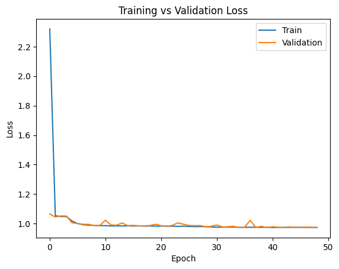
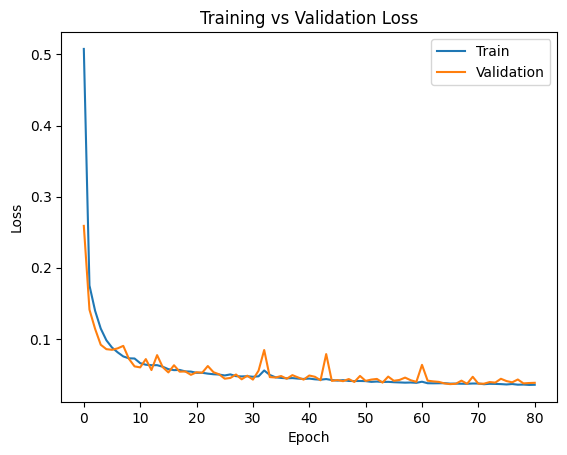
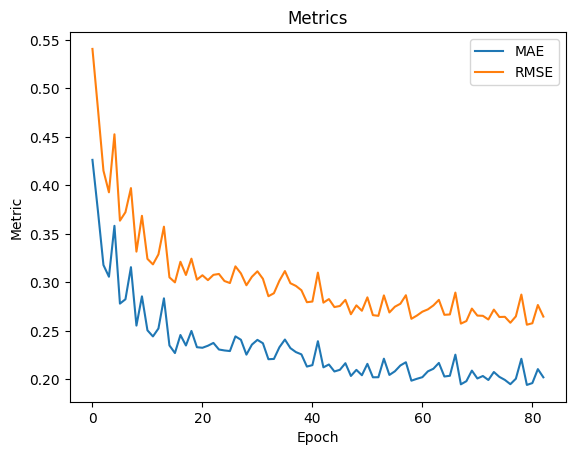
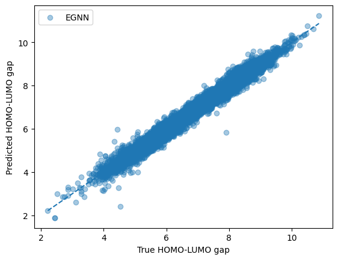
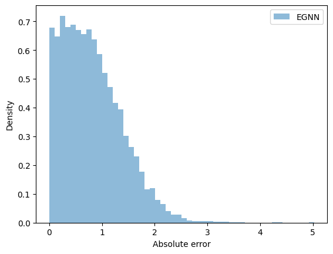
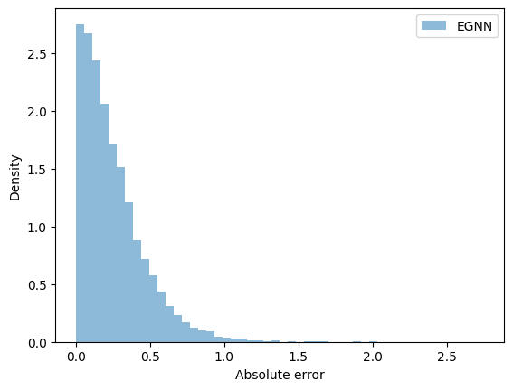
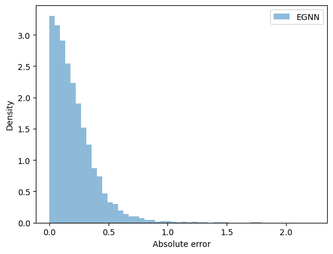

# Elisey_Goncharov_1124947149_final_dls_project
## Notebook's name: Untitled0_(2).ipynb
## English

Overview:
This is a research project for DLS school. The topic is Graph Neural Networks and Topological Data Analysis applied to micro-chemistry/physics problems.
In my work the goal was to buld an Equivariant Geometric Neural Network which also utilizes TDA, more precisely Vietoris-Rips complex, to predict HOMO-LUMO energy gaps of molecules. The dataset used was a standard PyG QM9 dataset with around 130000 molecules. And the reserch part is to see how EGNN and TDA help improve predictions, where I built some less complex and compared their performance.

The models used(in order of increasing complexiy):
1) Simple MLP that takes just the atom features as input.
2) A GNN that aggregates information from neighboring atoms via message passing.
3) EGNN that uses relative position vectors scaled by learned scalar functions of distances as geometric input features, ensuring translational and rotational equivariance.
4) An extension of EGNN that additionally incorporates topological features extracted using persistent homology.

About TDA:
For each molecule, persistence diagrams are computed for:
β₀ (connected components)
β₁ (cycles)
(β₂ is included where available but is often empty for small molecules.)
From each persistence diagram, we extract: the count of persistence intervals and the mean lifetime (death − birth) which are then concatenated with learned EGNN representations.

Training:
All models were trained for up to 150 epoch with early stopping based on validation MAE(min_delta=1e-3 and patience=15 epochs).
Best model state selection is based on the best validation performance.

## Русский

Обзор:
Данный проект является исследовательской работой для школы DLS. Тематика проекта — графовые нейронные сети (Graph Neural Networks) и топологический анализ данных (Topological Data Analysis, TDA), применённые к задачам микроскопической химии и физики. В рамках работы целью было построение эквивариантной геометрической нейронной сети (Equivariant Geometric Neural Network), которая также использует методы TDA, а именно комплекс Виеториса–Рипса, для предсказания энергетических зазоров HOMO–LUMO молекул.
В качестве датасета использовался стандартный набор QM9 из библиотеки PyG, содержащий около 130 000 молекул. Исследовательская часть работы направлена на изучение того, как использование EGNN и TDA влияет на качество предсказаний. Для этого были реализованы несколько моделей разной сложности и проведено сравнение их производительности.

Используемые модели (в порядке возрастания сложности):

1)Простой MLP, который принимает на вход только атомные признаки.
GNN, агрегирующая информацию от соседних атомов с помощью механизма передачи сообщений (message passing).
2)EGNN, использующая относительные векторы положений атомов, масштабированные обучаемыми скалярными функциями расстояний, в качестве геометрических входных признаков, что обеспечивает трансляционную и вращательную эквивариантность.
3)Расширение EGNN, которое дополнительно включает топологические признаки, извлечённые с помощью персистентной гомологии.

О TDA:
Для каждой молекулы вычисляются диаграммы персистентности для:
β₀ (связные компоненты), β₁ (циклы), β₂ (учитывается при наличии, но для малых молекул часто оказывается пустым).

Из каждой диаграммы персистентности извлекаются: количество интервалов персистентности, среднее время жизни интервалов (death − birth). Эти признаки затем конкатенируются с обучаемыми представлениями, полученными EGNN.

Обучение:
Все модели обучались до 150 эпох с использованием ранней остановки (early stopping) на основе значения MAE на валидационной выборке (min_delta = 1e-3, patience = 15 эпох). Выбор лучшего состояния модели осуществлялся по наилучшему качеству на валидации.

Comparison:

## Results
<table>
  <tr>
  <b>LOSSES</b>
    <td>
    <b>MLP</b></td>
    <td>
    <b>GNN</b></td>
    <td>
    <b>EGNN</b></td>
    <td>
    <b>EGNN+TDA</b></td>
  </tr>
  <tr>
  
   <td> <b>METRICS</b>
   <b>MLP</b></td>
    <td>
    <b>GNN</b></td>
    <td>
    <b>EGNN</b></td>
    <td>
    <b>EGNN+TDA</b></td>
  </tr>
  <tr>
   <td> <b>y_pred vs y_true</b>
   <b>MLP</b></td>
    <td>
    <b>GNN</b></td>
    <td>
    <b>EGNN</b></td>
    <td>
    <b>EGNN+TDA</b></td>
  </tr>
  <tr>
   <td> <b>ERROR DISTRIBUT</b>
   <b>MLP</b></td>
    <td>
    <b>GNN</b></td>
    <td>
    <b>EGNN</b></td>
    <td>
    <b>EGNN+TDA</b></td>
  </tr>
</table>

## TEST METRICS:

MLP

MAE: 0.8176
RMSE 0.9924

GNN

MAE: 0.2513
RMSE 0.3322

EGNN

MAE: 0.2077
RMSE 0.2768

EGNN+TDA

MAE:  0.1405
RMSE: 0.1862

Conclusion:
As we can see from both the visuals and the test metrics, incorporating equivariant geometric and topological features clearly improves the model’s prediction performance. The simple MLP fails to learn meaningful representations, which is reflected in its poor test metrics (MAE 0.82), while introducing graph-based message passing already leads to a significant improvement, reducing the MAE by approximately 69%.
With the incorporation of geometric features and equivariance, the EGNN achieves a further performance gain, improving the MAE by an additional 17% compared to the standard GNN. Finally, adding topological features via persistent homology provides the best overall performance: the EGNN+TDA model improves the MAE by approximately 32% relative to the EGNN baseline and achieves an overall ~83% reduction in MAE compared to the MLP.
I believe the reason why the improvement from TDA, while noticeable, is not even larger is that the dataset is relatively limited in terms of molecular variety and complexity (molecules contain up to 9 heavy atoms), and only a small fraction of samples exhibit non-trivial β₂ persistence features. Therefore, to fully observe the potential benefits of topological information, TDA should likely be applied to more complex molecular structures where higher-order topology plays a more crucial role.

Fututure-work and improvement:
The possible changes and improvements are the following:
1)Use a more advanced dataset such as protein structures or larger organic molecules with richer topology.
2)Adding richer topological features.
3)Experimenting with model's complexity.

## Русский

Заключение

Как видно из визуализаций и тестовых метрик, включение эквивариантных геометрических и топологических признаков заметно улучшает качество предсказаний модели. Простая MLP не способна выучить информативные представления, что отражается в её слабых тестовых результатах (MAE 0.82), тогда как переход к графовой модели с механизмом передачи сообщений уже приводит к существенному улучшению, снижая MAE примерно на 69%.
Добавление геометрических признаков и эквивариантности в EGNN даёт дальнейший прирост качества, обеспечивая дополнительное снижение MAE примерно на 17% по сравнению со стандартной GNN. Наконец, расширение EGNN топологическими признаками, извлечёнными с помощью персистентной гомологии, позволяет достичь наилучших результатов: модель EGNN+TDA улучшает MAE примерно на 32% относительно базовой EGNN и демонстрирует общее снижение MAE примерно на 83% по сравнению с MLP.
Я считаю, что причина того, почему вклад TDA, хотя и заметен, не является ещё более значительным, заключается в относительно ограниченной вариативности и сложности используемого датасета (молекулы содержат до 9 тяжёлых атомов), а также в том, что лишь небольшая часть выборки обладает нетривиальными β₂-персистентными признаками. Таким образом, чтобы в полной мере раскрыть потенциал топологических методов, TDA, вероятно, следует применять к более сложным молекулярным структурам, где высокоуровневая топология играет более существенную роль.

Направления дальнейших исследований и улучшений:

1)Возможные направления для дальнейшей работы и улучшений включают:
2)использование более сложных и разнообразных датасетов (не ограничиваясь малыми молекулами),
3)добавление более богатых топологических признаков, извлекаемых из диаграмм персистентности,
4)дальнейшие эксперименты с архитектурой моделей и уровнем их сложности.